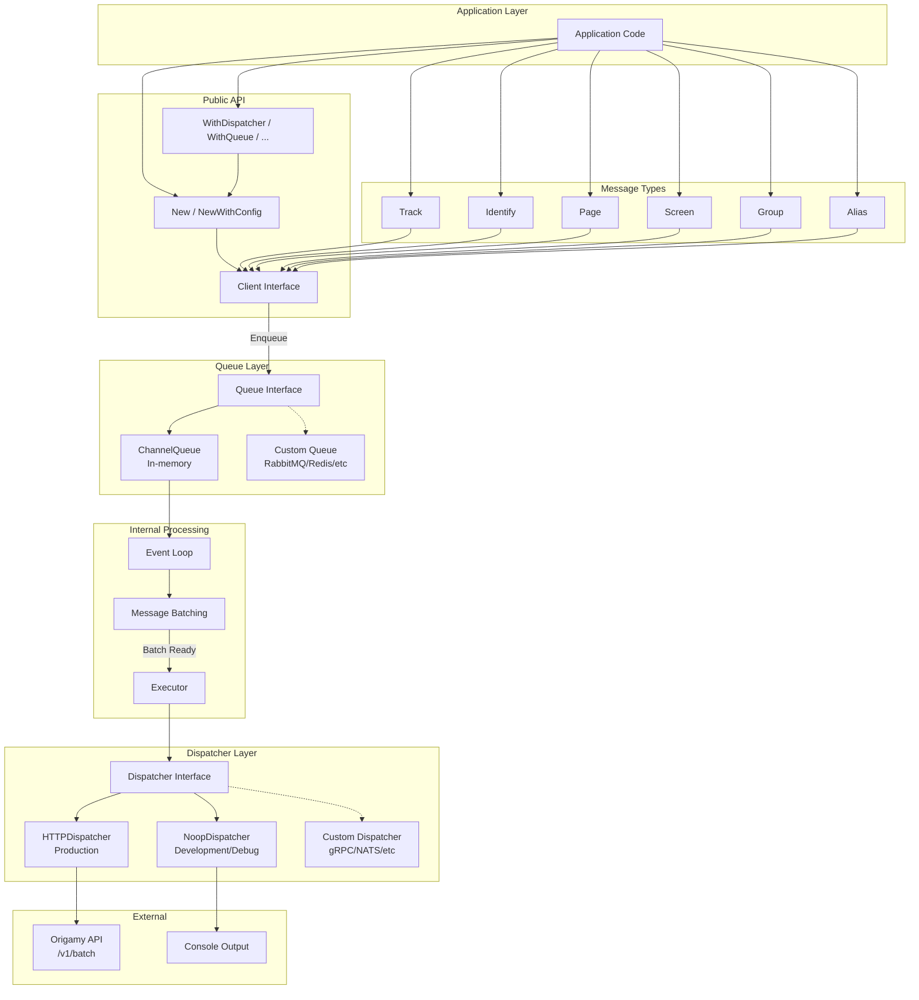
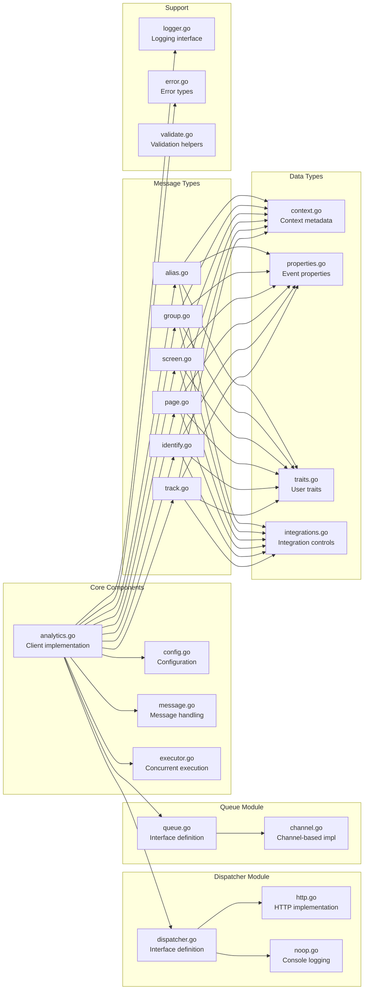
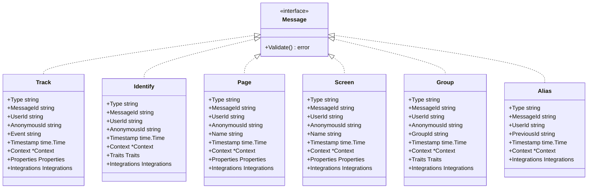
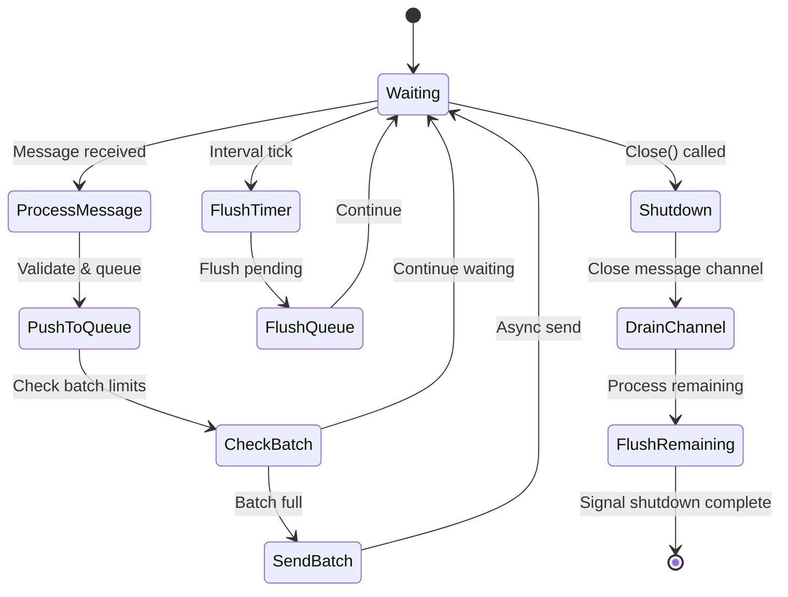
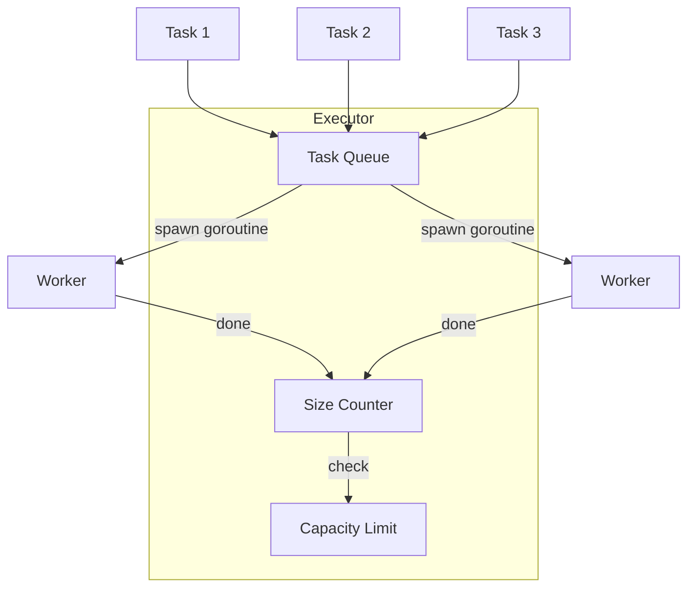
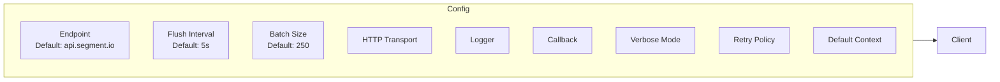
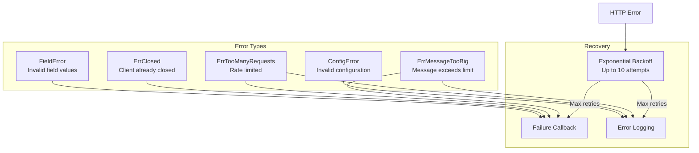

# Architecture

## Overview

Origamy SDK is a Go client library for the Origamy analytics API. It provides an asynchronous, batched approach to sending analytics events with automatic retry logic, configurable flushing, and concurrent request management.

The SDK is designed with pluggable interfaces for both message queuing and dispatching, allowing you to swap implementations for different use cases (development, testing, production) or integrate with external systems (RabbitMQ, Redis, gRPC, etc.).

## High-Level Architecture



## Component Architecture



## Key Interfaces

### Dispatcher Interface

The `Dispatcher` interface allows you to customize how events are sent to the backend:

```go
type Dispatcher interface {
    io.Closer
    Send(payload []byte) error
}
```

**Built-in Implementations:**

- `HTTPDispatcher` - Production HTTP transport (default)
- `NoopDispatcher` - Logs to console in human-readable format (development/debug)

### Queue Interface

The `Queue` interface allows you to customize how messages are buffered:

```go
type Queue[T any] interface {
    io.Closer
    Enqueue(msg T) error
    Dequeue() (T, bool)
    TryDequeue() (T, bool)
    Drain() <-chan T
    Channel() <-chan T
    Len() int
    IsClosed() bool
}
```

**Built-in Implementations:**

- `ChannelQueue` - In-memory Go channel-based queue (default)

## Functional Options Pattern

The SDK uses the functional options pattern for configuration:

```go
// Simple usage with defaults
client := origamy.New("write-key")

// With custom options
client := origamy.New("write-key",
    origamy.WithDispatcher(origamy.NewNoopDispatcher(origamy.DispatcherConfig{})),
    origamy.WithQueue(customQueue),
    origamy.WithVerbose(true),
    origamy.WithBatchSize(100),
)
```

## Data Flow

1. **Enqueue**: Application calls `client.Enqueue(message)`
2. **Validate**: Message is validated
3. **Queue**: Message is pushed to the Queue
4. **Batch**: Event loop collects messages into batches
5. **Serialize**: Batch is JSON serialized
6. **Dispatch**: Dispatcher sends the payload (or logs it for NoopDispatcher)
7. **Retry**: On failure, retry with exponential backoff
8. **Callback**: Success/failure callbacks are invoked

## Data Flow

```mermaid
sequenceDiagram
    participant App as Application
    participant Client as Client
    participant Chan as Message Channel
    participant Loop as Event Loop
    participant Queue as Message Queue
    participant Exec as Executor
    participant HTTP as HTTP Client
    participant API as Segment API

    App->>Client: Enqueue(Track{...})
    Client->>Client: Validate message
    Client->>Client: Add messageId & timestamp
    Client->>Chan: Send message

    loop Event Loop
        Chan->>Loop: Receive message
        Loop->>Queue: Push to queue

        alt Batch size reached OR Interval tick
            Queue->>Loop: Flush messages
            Loop->>Exec: sendAsync(batch)
            Exec->>HTTP: POST /v1/batch
            HTTP->>API: JSON payload
            API-->>HTTP: Response

            alt Success
                HTTP-->>Client: notifySuccess
            else Failure (retry)
                HTTP->>HTTP: Wait (exponential backoff)
                HTTP->>API: Retry request
            end
        end
    end

    App->>Client: Close()
    Client->>Chan: Close channel
    Loop->>Loop: Drain remaining messages
    Loop->>Client: Shutdown complete
```

## Key Interfaces

### Client Interface

```go
type Client interface {
    io.Closer
    Enqueue(Message) error
}
```

The main API for interacting with the analytics library. Messages are queued and sent asynchronously in batches.

### Message Interface

```go
type Message interface {
    Validate() error
}
```

All message types (Track, Identify, Page, Screen, Group, Alias) implement this interface.

### Callback Interface

```go
type Callback interface {
    Success(Message)
    Failure(Message, error)
}
```

Optional interface for receiving notifications about message delivery status.

### Logger Interface

```go
type Logger interface {
    Logf(format string, args ...interface{})
    Errorf(format string, args ...interface{})
}
```

Customizable logging interface for operational visibility.

## Message Types



## Internal Components

### Event Loop (`client.loop()`)

The event loop is the heart of the client, running in a dedicated goroutine:



### Executor

Manages concurrent HTTP requests with a configurable limit:



### Message Queue

Batches messages based on count and byte size limits:

- **Max Batch Size**: 250 messages (default)
- **Max Batch Bytes**: ~500KB
- **Max Message Size**: Limited per message

## Configuration



## Error Handling



## File Structure

```
origamy sdk/
├── analytics.go      # Core client implementation
├── config.go         # Configuration types and defaults
├── message.go        # Message queue and batch handling
├── executor.go       # Concurrent request executor
│
├── track.go          # Track message type
├── identify.go       # Identify message type
├── page.go           # Page message type
├── screen.go         # Screen message type
├── group.go          # Group message type
├── alias.go          # Alias message type
│
├── context.go        # Context metadata types
├── properties.go     # Properties helper type
├── traits.go         # Traits helper type
├── integrations.go   # Integrations control type
│
├── logger.go         # Logger interface
├── error.go          # Error types
├── validate.go       # Validation utilities
├── json.go           # JSON serialization helpers
│
├── timeout_15.go     # Go 1.5 timeout handling
├── timeout_16.go     # Go 1.6+ timeout handling
│
├── cmd/cli/          # CLI tool
├── examples/         # Usage examples
└── fixtures/         # Test fixtures
```

## Key Design Patterns

1. **Asynchronous Processing**: Messages are queued and processed in a background goroutine
2. **Batching**: Multiple messages are combined into single HTTP requests for efficiency
3. **Backpressure**: Channel-based flow control prevents memory exhaustion
4. **Graceful Shutdown**: `Close()` drains pending messages before terminating
5. **Retry with Backoff**: Failed requests are retried with exponential backoff
6. **Concurrent Execution**: Executor limits concurrent HTTP requests
7. **Callback Notifications**: Optional callbacks inform the application of success/failure
